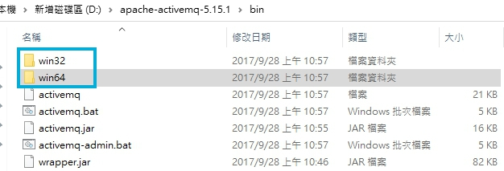
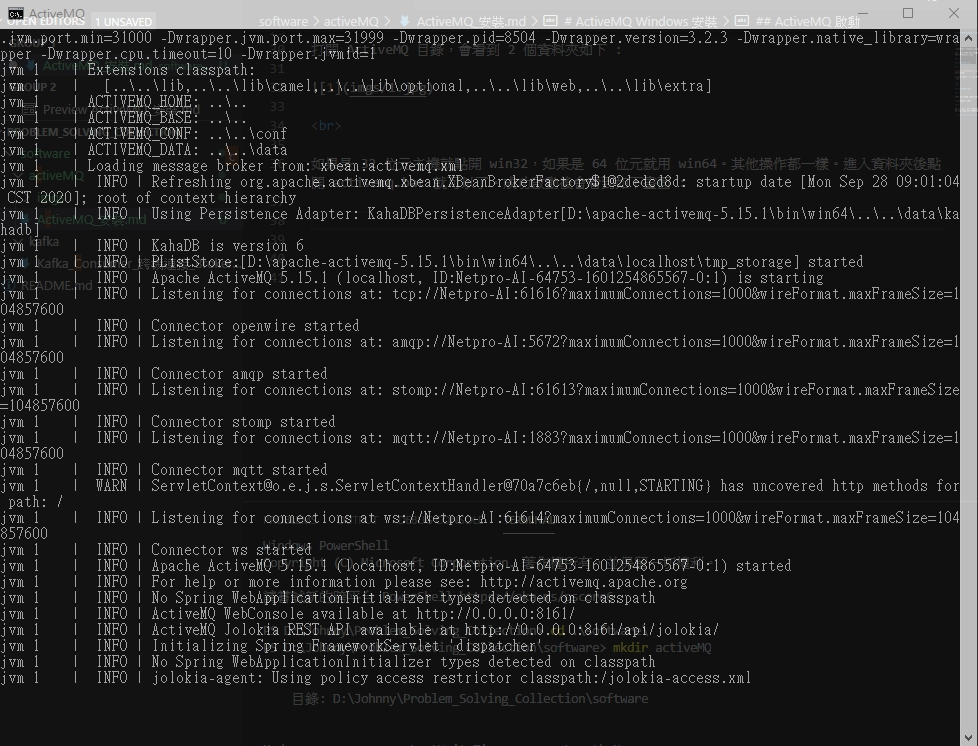
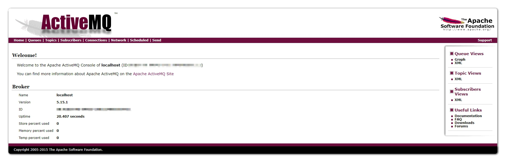

# ActiveMQ Windows 安裝

 

---

 
 
 

本篇示範在 Windows 10 環境下進行。

安裝 ActiveMQ 之前首先要先確保主機中有 JRE 並設定好 JAVA_HOME 環境變數。JRE 安裝這邊略過，直接進入主題。

 

## ActiveMQ 下載

 

[官方載點（windows & Linux）](https://activemq.apache.org/components/classic/download/)

官方釋出的是一個 zip 檔，下載好後直接解壓縮就可以了。盡量放在一個路徑上沒有空白的資料夾中。

 
 
 
 

## ActiveMQ 啟動

 

打開 ActiveMQ 目錄，會看到 2 個資料夾如下 : 

 

 

如果是 32 位元主機就點開 win32，如果是 64 位元就用 win64。其他操作都一樣。進入資料夾後點開 activemq.bat 就可以了。成功啟動後會看到如下畫面 : 

 

 

這樣就算成功啟動了。如果第一次執行時 cmd 畫面出現 Error （不是 JRE 沒設定的 Error 的話），重新啟動主機再試一次看看（親自踩過坑，卡了快一個小時找不到問題，reboot 就沒事了）。

 

啟動完成之後，打開此連結 :　http://127.0.0.1:8161/admin/

輸入帳密預設都是 `admin`

最終看到以下畫面就沒問題了 :

 

