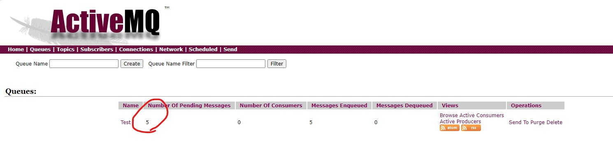

# ActiveMQ 官方重點整理

<br>

---

<br>

## 簡介

<br>

### __MOM__ 與 __JMS__：

<br>

`MOM`：訊息導向中介軟體 (Message-Oriented Middleware, MOM) 是一種可非同步、鬆散耦合、可靠性高、安全性高，用來處理並傳遞訊息的軟體。

`JMS`：是一種定義了訊息的建立、發送、接收等標準的 API，JMS 有兩種消息傳遞方式 __Publish-Subscribe__ 與 __Point-to-Point__。

<br>

ActiveMQ 是遵循了 JMS 規範並有高擴展性的開源 MOM。

<br>
<br>

### __Publish-Subscribe__ 與 __Point-to-Point__

<br>

`Publish-Subscribe`：可以有多個發送端 (Publish) 與多個接收端 (Subscribe)，ActiveMQ 使用 topic 接收他從發送端接收到的消息並發給所有的接收者。須注意的是此模式須先啟動接收端再啟動發送端，當發送端傳給 topic 時，__若接收端未啟動則不會接收到該消息。消息不會保留，也就是發送時沒接收到就算之後再開啟接收端依然收不到那個消息__。

`Point-to-Point`：一樣可以有多個發送端與接收端，ActiveMQ 使用 Queue 接收消息，可同步或非同步傳遞消息且一個消息只會有一個接收端去接收，若前面的接收端先接收了消息後面的接收端便接收不到該消息。消息會保留，也就是當發送端發送消息進 Queue 時，若沒有監聽的接收端則該消息會存放在 ActiveMQ 上，直到有監聽的接收端接收消息。

<br>
<br>

## 範例 (P2P)

<br>


### JMSProducer.java

<br>

```java
public class JMSProducer {

    public void send(String msg) throws JMSException {
        ActiveMQConnectionFactory connectionFactory = new ActiveMQConnectionFactory(
                ActiveMQConnectionFactory.DEFAULT_USER,
                ActiveMQConnectionFactory.DEFAULT_PASSWORD,
                "tcp://127.0.0.1:61616"
        );

        Connection connection = connectionFactory.createConnection();
        connection.start();

        Session session = connection.createSession(true, Session.AUTO_ACKNOWLEDGE);

        Destination destination = session.createQueue("Test");

        MessageProducer producer = session.createProducer(destination);

        IntStream.range(0, 5).forEach(i -> {
            try {
                TextMessage textMessage = session.createTextMessage(msg + i);
                producer.send(destination, textMessage, DeliveryMode.NON_PERSISTENT, 0, 500L);
                session.commit();
                Thread.sleep(500);
            } catch (JMSException | InterruptedException e) {
                e.printStackTrace();
            }
        });

        connection.close();
    }

    public static void main(String[] args) throws JMSException {
        JMSProducer jmsProducer = new JMSProducer();
        jmsProducer.send("message !!!!!!!!!!!!!!!!");
    }

}
```

<br>
<br>

### JMSConsumer.java

<br>

```java
public class JMSConsumer {

    public void startup() throws JMSException, InterruptedException {
        ActiveMQConnectionFactory connectionFactory = new ActiveMQConnectionFactory(
                ActiveMQConnectionFactory.DEFAULT_USER,
                ActiveMQConnectionFactory.DEFAULT_PASSWORD,
                "tcp://127.0.0.1:61616"
        );

        Connection connection = connectionFactory.createConnection();
        connection.start();

        Session session = connection.createSession(false, Session.AUTO_ACKNOWLEDGE);
        Destination destination = session.createQueue("Test");
        MessageConsumer consumer = session.createConsumer(destination);

        while (true){
            TextMessage msg = (TextMessage) consumer.receive();
            if (msg == null){
                break;
            }
            System.out.println("消息內容: " + msg.getText());
        }
    }
 
    public static void main(String[] args) throws JMSException, InterruptedException {
        JMSConsumer jmsConsumer = new JMSConsumer();
        jmsConsumer.startup();
    }
}
```

<br>
<br>

當使用 JMSProducer 發送消息之後，可以訪問 http://127.0.0.1:8161/admin/queues.jsp。



<br>

接下來使用 JMSConsumer 就好了。