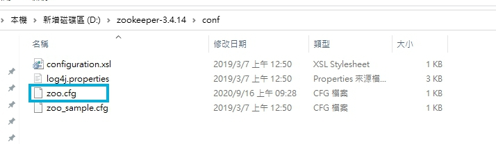
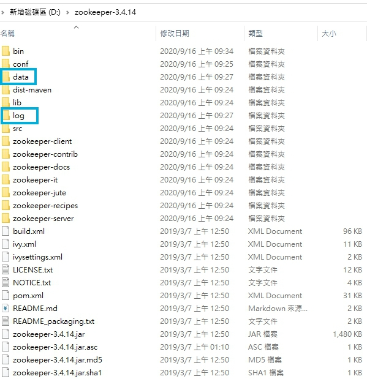
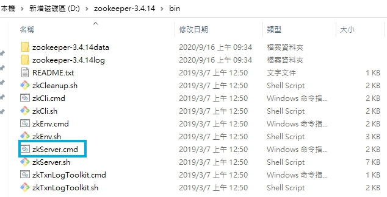
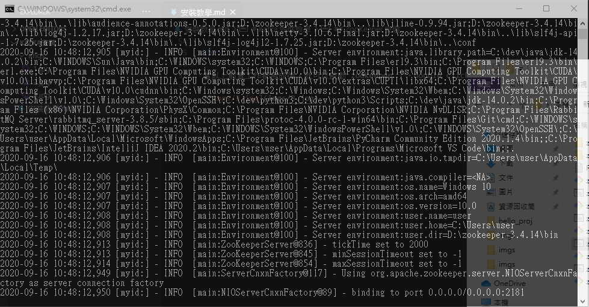
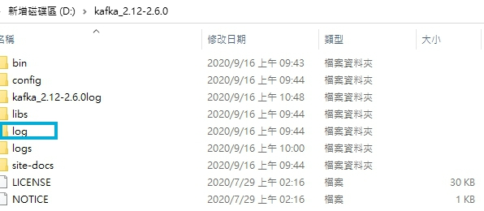
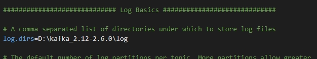

# Kafka 安裝教學

<br>

---

<br>

## 安裝前須知

<br>

本次安裝 Kafka 需要的依賴軟體版本 :

* JRE 1.8 以上 （不過多進行說明，記得要建立 JAVA_HOME 環境變數）

* [ZooKeeper 3.4.14](http://ftp.mirror.tw/pub/apache/zookeeper/zookeeper-3.4.14/zookeeper-3.4.14.tar.gz)

* [Kafka 2.6.0](http://ftp.mirror.tw/pub/apache/kafka/2.6.0/kafka_2.12-2.6.0.tgz)

<br>

---

<br>

## ZooKeeper 安裝

<br>

官方提供的資源都是 tar.gz 壓縮檔，在 windows 環境下直接解壓縮就可以了。記得不要把軟體解壓縮到 `C:\\Program Files` 資料夾，可以放在其他任何地方（保證路徑上沒有 __空格__）。

安裝好後，在 conf 資料夾下有一個 `zoo_sample.cfg`，複製一份並重命名為 `zoo.cfg` 放在當前資料夾下。



<br>

編輯 zoo.cfg 內容如下 : 

```txt
# the directory where the snapshot is stored.
# do not use /tmp for storage, /tmp here is just 
# example sakes.
dataDir=D:\zookeeper-3.4.14\data
dataLogDir=D:\zookeeper-3.4.14\log
```

<br>

實際上我們並沒有 data 與 log 資料夾，所以我們手動建立一下資料夾 :



<br>

當以上前置工作都完成後，就可以啟動 zookeeper 了。double click `zkServer.cmd`



<br>

如果都沒問題的話，會看到以下畫面 : 



清楚的看到綁定到本地 2181 port

<br>
<br>

---

<br>
<br>

## Kafka 安裝

<br>

Kafka 的安裝規則跟 Zookeeper 差不多，還是不要裝在 `Program Files` 裡面。自己找一個地方解壓縮就可以了。

<br>

先在安裝目錄下建立一個 log 資料夾 : 



<br>

進入 config 目錄修改 server.properties :



<br>
<br>

以上我們就算是建立好前置作業了，接下來要開始啟動部屬了。

<br>
<br>

第一步要先啟動 Broker，cmd 模式下進入 Kafka 根目錄 : `D:\kafka_2.12-2.6.0`

執行以下命令，啟動kafka通訊的伺服器broker

```bash
.\bin\windows\kafka-server-start.bat .\config\server.properties
```

<br>
<br>

建立 topic ，cmd 模式進入 `D:\kafka_2.12-2.6.0\bin\windows`，執行以下指令

```bash
kafka-topics.bat --create --zookeeper localhost:2181 --replication-factor 1 --partitions 1 --topic jikeh
```

<br>
<br>

啟動 producer

```bash
kafka-console-producer.bat --broker-list localhost:9092 --topic jikeh
```

<br>
<br>

啟動 consumer

```bash
kafka-console-consumer.bat --bootstrap-server localhost:9092 --topic jikeh
```

<br>
<br>

producer 與 consumer 都建立完畢之後，我們可以在 producer 介面輸入一些消息，送出消息之後，consumer 介面就會收到 producer 的消息。