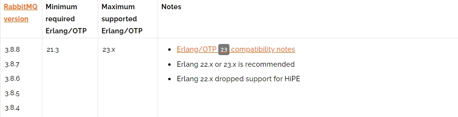
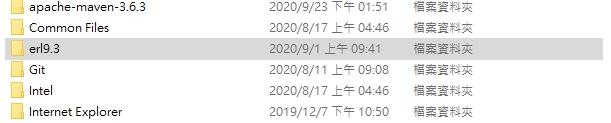
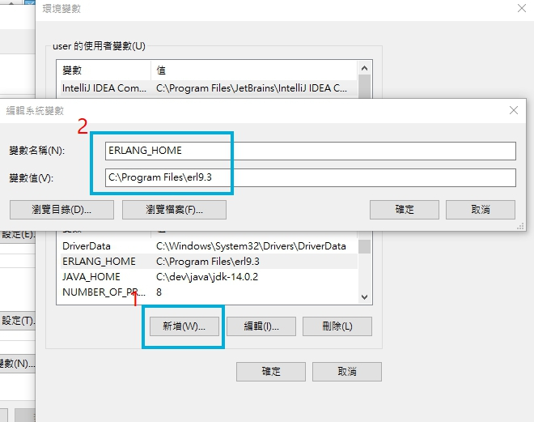
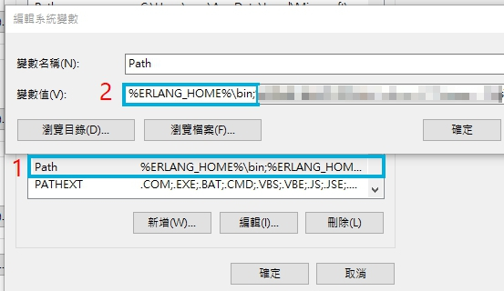
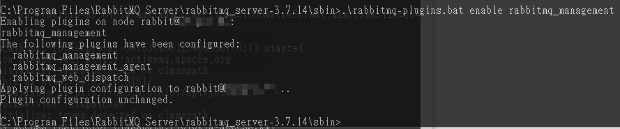
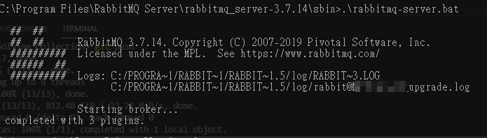
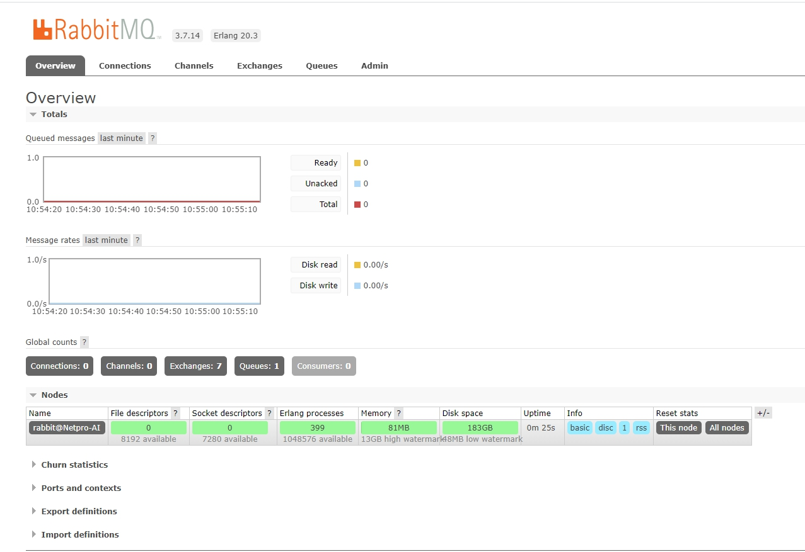

# RabbitMQ Windows 下載安裝

<br>

---

<br>
<br>

RabbitMQ 的安裝會比較麻煩一點。下面會詳細講解如何一步一步的安裝及設定環境。

<br>

## 安裝前說明

RabbitMQ 是使用 Erlang 語言實現的軟體。所以我們的環境中必須要有 Erlang。然後也要確保 Erlang 的版本跟 RabbitMQ 的版本要對得上，如何找到合適的版本可以參考這邊 : 

__RabbitMQ Erlang Version Requirement__　:　https://www.rabbitmq.com/which-erlang.html

<br>

舉例來說 : 




這張圖片的意思就是 RabbitMQ `3.8.4 ~ 3.8.8` 版本對應到 Erlang 的 `21.3 ~ 23.*` 版本。

確認好自己要需要的版本之後就安步就班的下載吧，這邊範例選用版本如下 :  

* RabbitMQ-3.7.14

* Erlang-20.3

<br>

下面開始進入正文。

<br>
<br>
<br>
<br>

## Erlang 下載與設定

<br>

本篇示範安裝設定 Erlang 20.3 -> 載點 : https://www.erlang.org/downloads/20.3

打開 .exe 安裝好後我們會看到安裝資料夾如下 : 

<br>



<br>

我們下載的是 Erlang 20.3，但是安裝好後變成 Erlang 9.3 了。這是沒有問題的，事實上他就是 20.3 只是版號規則而已就像 jdk 1.8 也較 jdk 8 一樣。而且 1.8 之後就沒聽說還有人叫 jdk 1.9，jdk 1.14 之類的了。

<br>

安裝好後，接下來要設定環境變數了，__這一步很重要一定要設定 ERLANG_HOME__。

<br>



<br>

然後再 Path 中加入 ERLANG_HOME 即可。

<br>



<br>

測試一下是否成功安裝就打開 cmd 輸入 erl，成功進入指令交互介面就算成功。

<br>
<br>
<br>
<br>

## 下載安裝 RabbitMQ

<br>

All release 載點 : https://www.rabbitmq.com/changelog.html

<br>

這邊選擇跟 Erlang 20.3 版本匹配的 RabbitMQ 3.7.14 （[傳送門](https://github.com/rabbitmq/rabbitmq-server/releases/download/v3.7.14/rabbitmq-server-3.7.14.exe)）

<br>

下載安裝好之後，以 CMD 模式進入到 RabbitMQ 內的 sbin 資料夾，輸入以下指令 （記得如果安裝在 C 槽要以系統管理員身分使用 CMD 否則會被 deny）: 

```
.\rabbitmq-plugins.bat enable rabbitmq_management
```

開啟 rabbitMQ 管理套件功能，成功後畫面如下。



<br>
<br>

完成後就可以開始 rabbitMQ 了。一樣在 CMD 執行以下指令即可開啟服務 : 

```
.\rabbitmq-server.bat
```

成功啟動後會看到以下畫面 : 



<br>

打開連結 http://localhost:15672/ 帳密預設統一為 `guest`。看到以下頁面就大功告成。

<br>

