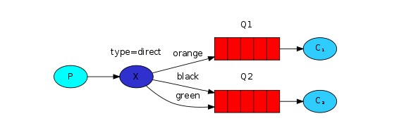
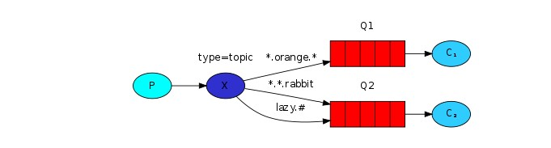

# 套件重點知識整理

<br>

----

<br>

關於套件的一些重要知識整理放在這裡。

<br>
<br>

## Message acknowledgment （消息確認）

<br>

一般來說當 queue 內有一個 Task 需要被處理，且這個 Task 已經被分派給一個 Worker (Consumer) 處理時，這個 Task 就會被 queue 移除掉。如果在移除掉 Task 之後，Worker 不巧剛好崩潰或者被強行中止。那這一筆 Task 就沒有被正確妥善處理並且遺失了。

為了避免上述問題，就有了 Message acknowledgment 機制。簡單來說就是 queue 會等待 Worker 端回傳一個確認消息，當收到 Worker 的 Task 已處理完畢的消息後 queue 才會真正的移除掉 Task。

<br>

在實際使用上我們需要在 Worker 端這樣編寫 ：

<br>

```java
String taskQueueName = "hello";


DeliverCallback deliverCallback = (consumerTag, delivery) -> {
    String message = new String(delivery.getBody(), "UTF-8");

    System.out.println(" [x] Received '" + message + "'");
    try {
        doWork(message);
    } finally {
        System.out.println(" [x] Done");
        // 消息處理完畢後手動發送 basicAck 確認消息。
        channel.basicAck(delivery.getEnvelope().getDeliveryTag(), false);
    }
};
boolean autoAck = false; // 自動消息確認關閉(手動處理)
channel.basicConsume(taskQueueName, autoAck, deliverCallback, consumerTag -> { });
```

<br>
<br>
<br>
<br>

## Message durability（消息持久化）

<br>

上面的 Message acknowledgment 是防止 Worker (consumer) 突發狀況未正確處理消息導致 queue 把 Task 刪掉造成 Task 丟失。Message durability 這個機制是防止 Server 端出現狀況導致 Task 丟失。

<br>

如何把 queue 宣告為持久態呢？在 producer 裡面可以像這樣做：

<br>

```java
boolean durable = true;
channel.queueDeclare("task_queue", durable, false, false, null);
```

<br>

__有一點非常關鍵，就是我們不可以把之前已經建立的 queue 臨時改成 durability 狀態__，如果想要把 queue 持久化，那就必須重新建立一個新的 queue。

<br>

在送出資料的時候也需要指定 Message 屬性：

<br>

```java
String message = "hello world!";
channel.basicPublish("", "task_queue", MessageProperties.PERSISTENT_TEXT_PLAIN, message.getBytes());
```

<br>
<br>
<br>
<br>

## Fair dispatch （公平調派）

<br>

一般來說，queue 的調派是當 queue 內有多少 Task 都一口氣分配出去給 Worker 處理。這樣一來有一個問題，假如有 2 個 Worker，queue 中有 10 個 Task，基數個 Task 非常輕鬆，偶數個 Task 繁瑣，這樣一來 Worker1 就非常閒，Worker2 則會負荷大量工作。

Fair dispatch 就是為解決這樣的問題而存在的。我們可以使用  `basicQos` 方法 帶入 `prefetchCount = 1` 的設定。這個方法告訴 RabbitMQ 不要同時分派一個以上 Task 到 worker。換句話說就是直到收到目標 Worker 回傳的 acknowledgment 之前不要再給這個 Worker 分派一個 Task。

<br>

在 Worker 部分定義一次只收一個 Task：

<br>

```java
int prefetchCount = 1;
channel.basicQos(prefetchCount);
```

<br>
<br>
<br>
<br>

## Exchanges

<br>

exchange 存在於 producer 與 queue 之間：

<br>


<br>

exahange 可以宣告成 4 個型態：`direct`, `topic`, `headers`, `fanout`。

<br>

```java
channel.exchangeDeclare("logs", "fanout");
```

<br>

`fanout` 就字面意思是扇出（廣播的意思），每一個與 exchange 綁定的 queue 都會收到這個 exchange 發出的消息。

<br>

一般來說 producer 生產資料後不會直接把資料傳給 queue，而是先傳給 exchange，再由 exchange 傳給 queue。如果 produce 在推送資料給 exchange 的時候沒有指定 exchange name 的話，會把資料傳到 default exchange 內。

<br>

```
channel.basicPublish("", "hello", null, message.getBytes());
```

<br>

像上面的 `basicPublish` 方法，第一個參數就是指定 exchangeName，這裡沒有指定，就是送去 default exchange，__當沒有指定 exchange name 的話必須指定 queue name__，這樣資料才之後要被送去哪裡。

<br>

如果 producer 要把資料送到指定 exchange 的話可以這樣做：

<br>

```java
channel.basicPublish( "logs", "", null, message.getBytes());
```

<br>

這樣 producer 就知道把資料送給名為 `logs` 的 exchange 了。

<br>

使用自訂名 exchange　的 producer： 

<br>

```java
channel.exchangeDeclare(EXCHANGE_NAME, "fanout");

String message = "info: Hello World!";

channel.basicPublish(EXCHANGE_NAME, "", null, message.getBytes("UTF-8"));
System.out.println(" [x] Sent '" + message + "'");
```

<br>

consumer 部分：

<br>

```java
​channel.exchangeDeclare(EXCHANGE_NAME, "fanout");

// 生成一個隨機名稱，非持久、獨占、自動刪除的 queue。
​String queueName = channel.queueDeclare().getQueue();

// queue 與 exchange 綁定。
​channel.queueBind(queueName, EXCHANGE_NAME, "");

​System.out.println(" [*] Waiting for messages. To exit press CTRL+C");

​DeliverCallback deliverCallback = (consumerTag, delivery) -> {
    String message = new String(delivery.getBody(), "UTF-8");
    ​System.out.println(" [x] Received '" + message + "'");
​};
​channel.basicConsume(queueName, true, deliverCallback, consumerTag -> { });
```

<br>
<br>
<br>
<br>

## Routing （路由）

<br>

先前講到 exchange 使用的模式是 `fanout`，這種模式會無差別的廣播消息讓所有綁定 exchange 的 queue 都能收到消息。

<br>

queue 綁定 exchange 如下：

<br>

```java
channel.queueBind(queueName, EXCHANGE_NAME, "");
```

<br>

事實上第三個參數可以指定 __routingKey__。像這樣：

<br>

```java
channel.queueBind(queueName, EXCHANGE_NAME, "black");
```

<br>

搭配使用 __routingKey__ 我們需要指定 exchange 的型態是 `direct`：

<br>

```java
channel.exchangeDeclare(EXCHANGE_NAME, "direct");
```

<br>

這樣一來，整個架構就會像下面這張圖：

<br>



<br>

queue 可以設定自己願意接收的 routingKey 資料，綁定 exchange 之後，當 producer 產生消息時就可以帶入一個 routingKey，exchange 往 queue 派送消息時會會直接根據 routingKey 把消息推送給目標 queue。

<br>

一個 queue 也可以綁定多個 routingKey：

<br>

```java
List<String> routingKeys = new ArrayList<>();
routingKeys.add("black");
routingKeys.add("green");

routingKeys.forEach(key -> {
    try {
        channel.queueBind(queueName, EXCHANGE_NAME, key);
    } catch (IOException e) {
        e.printStackTrace();
    }
});
```

<br>
<br>
<br>
<br>

## Topic （主題）

<br>

exchange 有一個 `topic` 屬性，跟 `direct` 的差別在於 `direct` 是直接指定一個明確的 routingKey，`topic` 可以有一種模糊字的概念：

<br>



<br>

* *（星號）可以正好代替一個詞。

* \# (hash) 可以代替零個或多個單字。

<br>

舉幾個例子來說，當 producer 產生消息並標示 routingKey 時：

<br>

* `quick.orange.rabbit` 的消息推送會進入到 Q1 與 Q2。

* `lazy.orange.elephant` 的消息推送會進入到 Q1 與 Q2。

* `quick.orange.fox` 只會進入 Q1。

* `lazy.brown.fox` 只會進入 Q2。

* `quick.brown.fox` 不匹配任何綁定，因此將被丟棄。

<br>

實例示範：

<br>

producer：

<br>

```java
 channel.exchangeDeclare(EXCHANGE_NAME, "topic");

String routingKey = "quick.orange.fox";
String message = "hello world!";

channel.basicPublish(EXCHANGE_NAME, routingKey, null, message.getBytes("UTF-8"));
```

<br>
<br>

consumer：

<br>

```java
channel.exchangeDeclare(EXCHANGE_NAME, "topic");
String queueName = channel.queueDeclare().getQueue();

List<String> routingKeys = new ArrayList<>();
routingKeys.add("*.*.rabbit");
routingKeys.add("lazy.#");

routingKeys.forEach(key -> {
    try {
        channel.queueBind(queueName, EXCHANGE_NAME, key);
    } catch (IOException e) {
        e.printStackTrace();
    }
});

DeliverCallback deliverCallback = (consumerTag, delivery) -> {
    String message = new String(delivery.getBody(), "UTF-8");
    System.out.println(" [x] Received '" + delivery.getEnvelope().getRoutingKey() + "':'" + message + "'");
};

channel.basicConsume(queueName, true, deliverCallback, consumerTag -> { });
```

<br>
<br>
<br>
<br>

